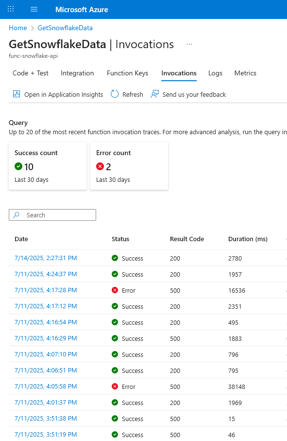
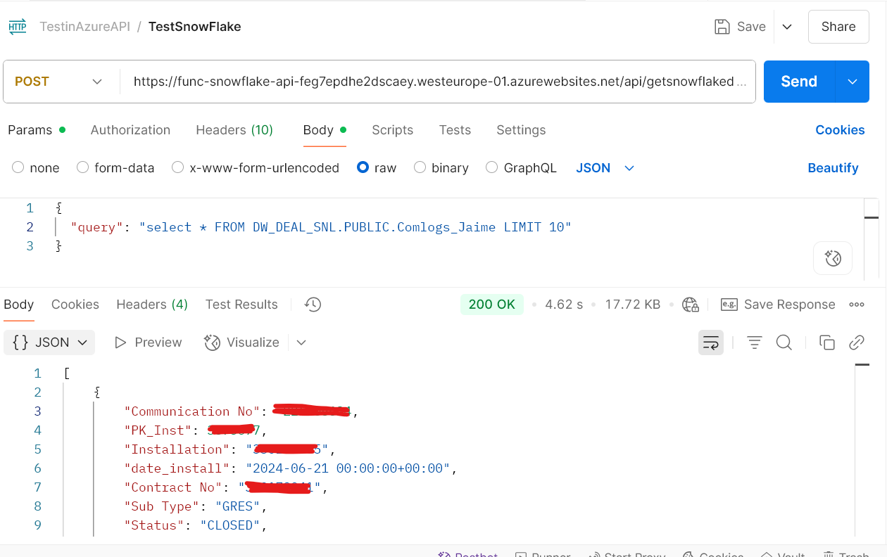

# API Endpoints

## Function App: `func-snowflake-api`

### POST /api/getsnowflakedata

**Description:**  
This endpoint allows executing a SQL query on Snowflake using private key authentication. It is designed to be consumed by platforms like OutSystems, backend integrations, or BI tools such as Power BI.

---

### Production Endpoint

https://func-snowflake-api-feg7epdhe2dscaey.westeurope-01.azurewebsites.net/api/getsnowflakedata?code={function_Key}


> Note: You must include the `code` query parameter to authenticate (function-level access key).

---

### Requirements

Send a `POST` request with a `Content-Type: application/json` header.  
The JSON body must include a valid SQL query string under the field `query`.

#### Request Example

```http
POST /api/getsnowflakedata
Content-Type: application/json

{
  "query": "SELECT * FROM your_table LIMIT 10"
}
```
### Expected Response (200 OK)

A list of JSON objects representing the query results from Snowflake.

#### Response Example

```json
[
  {
    "Communication No": -XXXXXXXXXXXX,
    "PK_Inst": 3675677,
    "Installation": "XXXXXXXXX",
    "date_install": "2024-06-21T00:00:00+00:00",
    "Contract No": "XXXXXXXXXXX",
    "Status": "CLOSED",
    "create_user_name": "Rishi XXXXXXXXX",
    "Resolution Description": "Added info about installation/customer",
    "Time Communication": "2024-07-17T12:30:51"
  },
  {
    "Communication No": -XXXXXXXXXXX,
    "PK_Inst": XXXXXXXXXX,
    "Installation": "XXXXXX",
    "create_user_name": "Sonny van XXXXXXXX"
  }
]
```
Note: The fields returned depend entirely on the columns in the SQL query provided.

### Error Handling

| Status Code | Description                                      |
|-------------|--------------------------------------------------|
| 400         | The `query` field is missing or invalid.         |
| 500         | Internal server error during Snowflake connection or execution. |

All exceptions are logged using logging.exception() in the Azure Function.

### Authentication

- The endpoint uses function-level authentication (`AuthLevel.FUNCTION`).
- Requests must include the `code` parameter in the URL.
- All credentials and private keys are managed through environment variables.
- Nothing is hardcoded in the source code.

---

### Use Cases

- Calling Snowflake data from low-code platforms (e.g. OutSystems).
- Building custom dashboards or reports that depend on dynamic Snowflake queries.
- Exposing serverless APIs for internal tools or BI platforms.

  ---

### API in Action

####  Azure Function Invocations

This screenshot shows real usage from the Azure Portal (success and error counts):



####  Postman Test

This shows a successful SQL query execution via Postman calling the Azure Function API:



