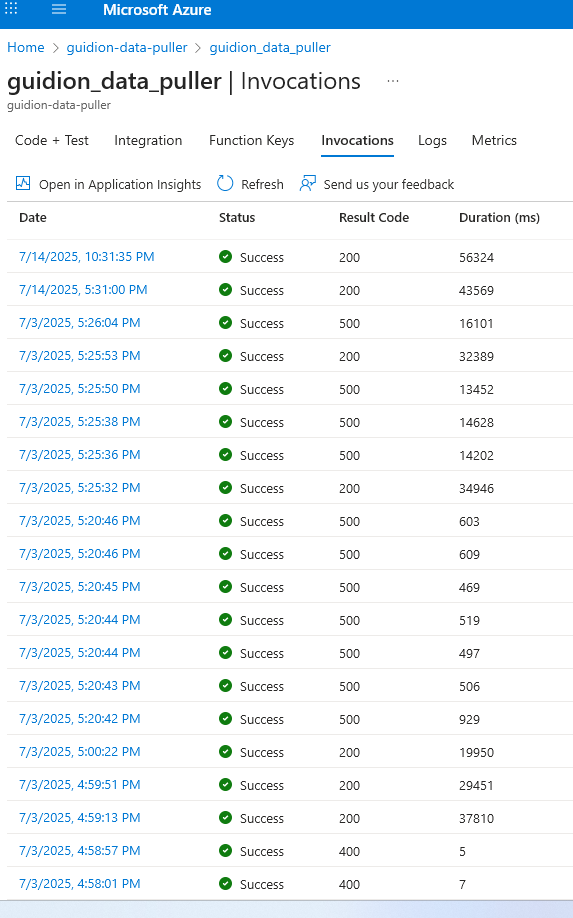
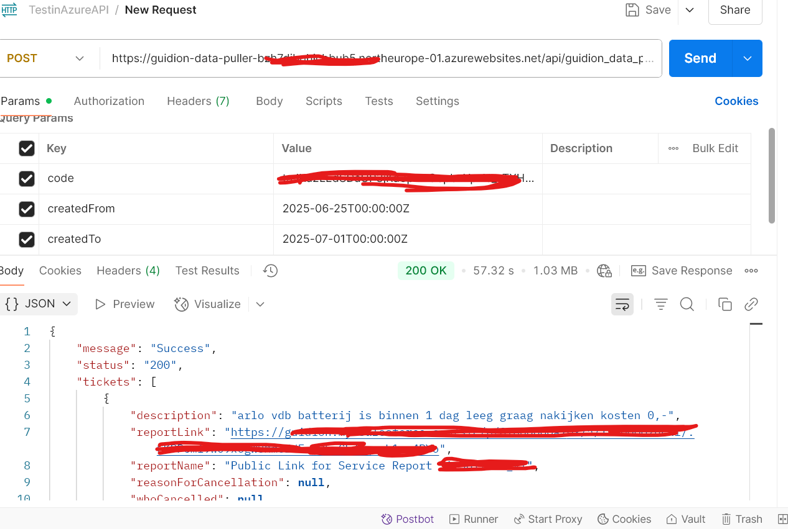

# API Endpoints

## Function App: `guidion-data-puller-api`

### GET /api/guidion_data_puller

**Description:**  
This endpoint connects to the external Guideon API using OAuth2 client credentials. It allows fetching service tickets filtered by creation or modification dates. The function is implemented as an Azure Function with secure environment-managed credentials.

## Authentication & Security

- API requests must include a `?code=` key to access the Azure Function.
- The function performs a secure OAuth2 token request to the Guideon authorization server.
- The access token is then used to call the `/v2/tickets` endpoint.
---

### Production Endpoint

`https://guidion-data-puller-<my-app>.azurewebsites.net/api/guidion_data_puller?code={function_key}`

Example call:

https://guidion-data-puller-xyz.azurewebsites.net/api/guidion_data_puller?code={function_key}&createdFrom=2025-06-25T00:00:00Z&createdTo=2025-07-01T00:00:00Z


>  **Note**: The `code` query parameter is required for authentication (`AuthLevel.FUNCTION`).

---

### Requirements

- Method: `POST`
- Required query parameters:
  - `createdFrom`: ISO 8601 datetime (e.g., `2025-06-25T00:00:00Z`)
  - `createdTo`: ISO 8601 datetime (must be within 7 days of `createdFrom`)
- Optional query parameters:
  - `lastModifiedFrom`, `lastModifiedTo`
  - `pageNo`, `pageSize`
  - `contractExternalId`

All query parameters are passed to the external Guideon API.

---

### Authentication

- The Azure Function uses **function-level access** (`AuthLevel.FUNCTION`)
- The backend calls Guideon's API using OAuth2 with client credentials
- The following environment variables are required:
  - `TOKEN_URL`
  - `CLIENT_ID`
  - `CLIENT_SECRET`
  - `SCOPE` *(optional)*
  - `DATA_URL` *(endpoint for ticket data)*

---

### Request Example

```http
GET /api/guidion_data_puller?createdFrom=2025-06-25T00:00:00Z&createdTo=2025-07-01T00:00:00Z&code={function_key}
Host: guidion-data-puller-xyz.azurewebsites.net


```
### Expected Response (200 OK)

A JSON object containing a status message and an array of ticket data.

#### Response Example

```json
  {
  "message": "Success",
  "status": "200",
  "tickets": [
    {
      "description": "arlo vdb batterij is binnen 1 dag leeg graag nakijken kosten 0,-",
      "partnerCustomerId": "xxxxxxx",
      "contractExternalId": "ARLO",
      "created": "2025-06-25T07:14:38.000Z",
      "status": "Completed",
      "workOrders": [
        {
          "subject": "Verisure-ARLO",
          "status": "Completed",
          "productsConsumed": [
            {
              "name": "ESSENTIAL2 FHD VIDEO DOORBELL",
              "type": "Loan"
            }
          ]
        }
      ]
    }
  ]
}
```
Note: The structure and fields of the response depend on the external Guideon API.

### Error Handling

| Status Code | Description                                                         |
|-------------|---------------------------------------------------------------------|
| 400         | The required parameters `createdFrom` and/or `createdTo` are missing or invalid. |
| 500         | Internal server error during token retrieval or Guideon API call.   |

All exceptions are logged using `logging.exception()` in the Azure Function.

### Authentication

- The endpoint uses function-level authentication (`AuthLevel.FUNCTION`).
- Requests must include the `code` parameter in the URL.
- The function authenticates to the Guideon API using OAuth2 (client credentials).
- All secrets (`CLIENT_ID`, `CLIENT_SECRET`, etc.) are securely managed through environment variables.
- Nothing is hardcoded in the source code.

---

### Use Cases

- Pulling tickets from Guideon for operational monitoring and performance dashboards.
- Feeding service data into Power BI or similar BI platforms.
- Enabling backend systems to synchronize external ticket data with internal databases.
- Automating reporting and analytics of field service activity.

---


---

### API in Action

#### Azure Function Invocations

This screenshot shows real usage of the `guidion_data_puller` Function App in Azure.  
You can observe successful (200), bad request (400), and internal error (500) responses (due to the fact the RAM could not handle the amount of data in that call), useful to validate the function’s robustness and error logging.



#### Postman Test

This example shows a successful invocation using Postman with the required query parameters:  
`createdFrom`, `createdTo`, and the `code` for authentication.  
The response includes a list of ticket records retrieved from the Guideon API via the Azure Function.


